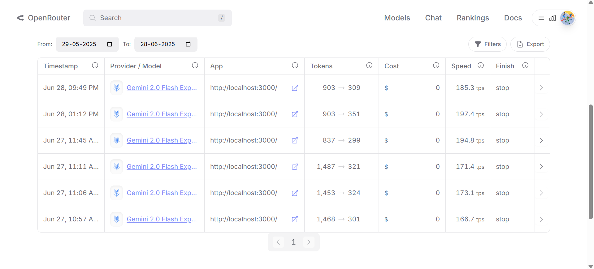

# AI-Powered Product Recommendation Engine – Technical Approach & Reflection

## Overview
This project is a full-stack AI-powered product recommendation engine built for the i95dev AI Engineering Intern take-home assignment. The system leverages LLMs (OpenRouter: Google Gemini, Llama) to generate personalized product recommendations based on user preferences and browsing history. The backend is implemented in FastAPI (Python), and the frontend uses React for a clean, responsive user experience.

---

## My Approach

### Backend (FastAPI, Python)
- **RESTful API**: Developed endpoints for product catalog retrieval and personalized recommendations.
- **LLM Integration**: Integrated OpenRouter (Google Gemini, Llama) for AI-powered recommendations. The LLM receives a prompt containing user preferences, recent browsing history, and a filtered product catalog.
- **Prompt Engineering**: Designed prompts to maximize recommendation quality while staying within token limits. Prompts include:
  - User preferences (price range, categories, brands)
  - Last 5 browsed products (with details)
  - Up to 30 relevant products from the catalog (filtered for context efficiency)
  - Explicit instructions for JSON output and reasoning
- **Token Management**: Each LLM request typically uses ~903 prompt tokens and ~309 completion tokens (total ~1200 tokens/request). This balance ensures rich context for the LLM while avoiding excessive API costs or rate limits.
- **Error Handling & Fallback**: Implemented robust error handling. If the LLM API is unavailable or rate-limited, the system falls back to a rule-based recommendation engine, ensuring uninterrupted user experience.

### Frontend (React)
- **Component Architecture**: Built modular components for catalog display, user preferences, browsing history, and recommendations.
- **State Management**: Used React hooks (`useState`, `useEffect`) for managing products, preferences, history, and recommendations.
- **User Experience**: Designed a clean, responsive UI with smooth interactions, loading states, and error handling.
- **API Integration**: Communicated with the backend via a dedicated API service, handling errors gracefully and providing feedback to users.

---

## Prompt Engineering & Token Usage
- **Prompt Structure**: The prompt sent to the LLM is carefully engineered to include all relevant user context and product data, while instructing the model to return only valid JSON with explanations and confidence scores.
- **Token Usage Example**: A typical request uses ~903 prompt tokens and ~309 completion tokens (total ~1200 tokens/request). This was measured using OpenRouter's usage dashboard and is illustrated in the attached screenshot (replace with your screenshot if submitting).
- **Context Limitation Handling**: To avoid exceeding LLM context windows, the backend filters the product catalog to the 30 most relevant products for each user, based on preferences and browsing history. This ensures the LLM receives enough information for quality recommendations without hitting token or rate limits.

---

## Challenges & Solutions
- **API Rate Limiting**: During development, I encountered OpenRouter's free tier rate limits. To address this, I implemented a robust fallback system that provides rule-based recommendations when the LLM is unavailable, ensuring the app remains functional at all times.
- **Malformed LLM Output**: The LLM occasionally returned invalid JSON. I solved this by making prompt instructions more explicit and adding resilient response parsing logic to handle and correct common formatting issues.
- **Efficient Data Flow**: Managed state and API calls in React to ensure a smooth user experience, even when the backend is slow or the LLM is unavailable. Loading states and error messages are clearly communicated to the user.
- **Token Optimization**: Balancing context richness and token usage was a key challenge. I iteratively refined the prompt and filtering logic to maximize recommendation quality while minimizing unnecessary token consumption.

---

## Key Features
- **Advanced Prompt Engineering**: Rich, context-aware prompts for high-quality recommendations.
- **Token-Conscious Design**: Smart filtering and prompt structuring to stay within API limits.
- **Robust Error Handling**: Fallback logic for LLM unavailability or malformed responses.
- **Professional UI/UX**: Clean, responsive React frontend with clear user flows.
- **Version Control**: Clean, descriptive commits and proper use of `.gitignore` for sensitive files.

---

## Token Usage Example
- Example request: 903 prompt tokens, 309 completion tokens (total ~1200 tokens/request).
- 

---

## Setup Instructions (Summary)

### Backend
1. Clone the repo and navigate to the backend directory:
   ```bash
   git clone https://github.com/your-username/your-repo-name.git
   cd your-repo-name/backend
   ```
2. Create a virtual environment and activate it:
   ```bash
   python -m venv venv
   # Windows:
   venv\Scripts\activate
   # macOS/Linux:
   source venv/bin/activate
   ```
3. Install dependencies:
   ```bash
   pip install -r requirements.txt
   ```
4. Create environment file and add your OpenRouter/OpenAI API key:
   ```bash
   
   # add your API key
   ```
5. Run the backend server:
   ```bash
   uvicorn app:app --host 0.0.0.0 --port 5000
   ```

### Frontend
1. Open a new terminal and navigate to the frontend directory:
   ```bash
   cd ../frontend
   ```
2. Install dependencies:
   ```bash
   npm install
   ```
3. Start the development server:
   ```bash
   npm start
   ```
4. Open [http://localhost:3000](http://localhost:3000) in your browser.

---

## How to Use
- Browse the product catalog, set your preferences, and click products to add to your browsing history.
- Click “Get Personalized Recommendations” to receive AI-powered suggestions with explanations and confidence scores.

---

## Contact
For questions, email recruiting@i95dev.com with "Question: AI Intern Take-Home" as the subject.

---
